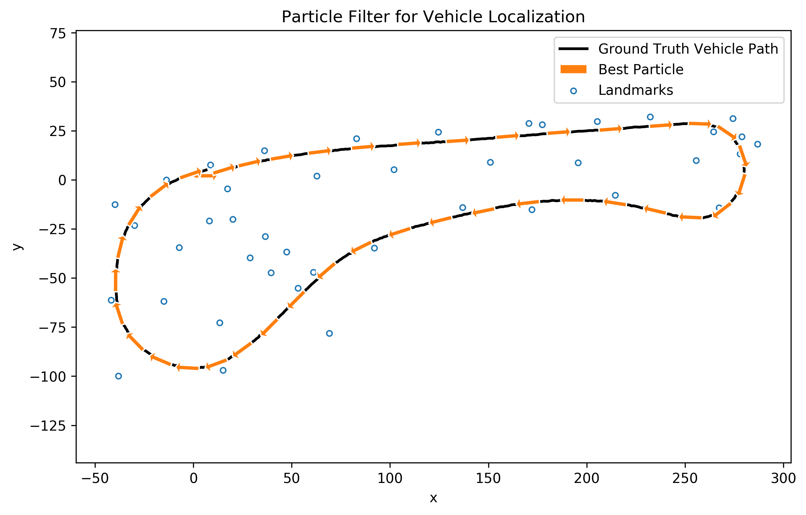

# **Particle Filter for Vehicle Localization**

Project to localize a vehicle using a Particle Filter and sensor data from detected landmarks surrounding the vehicle.

Project Description: [DESCRIPTION.md](DESCRIPTION.md)  
Source code: [src/](src/)  

## Vehicle Localization with Particle Filter:

